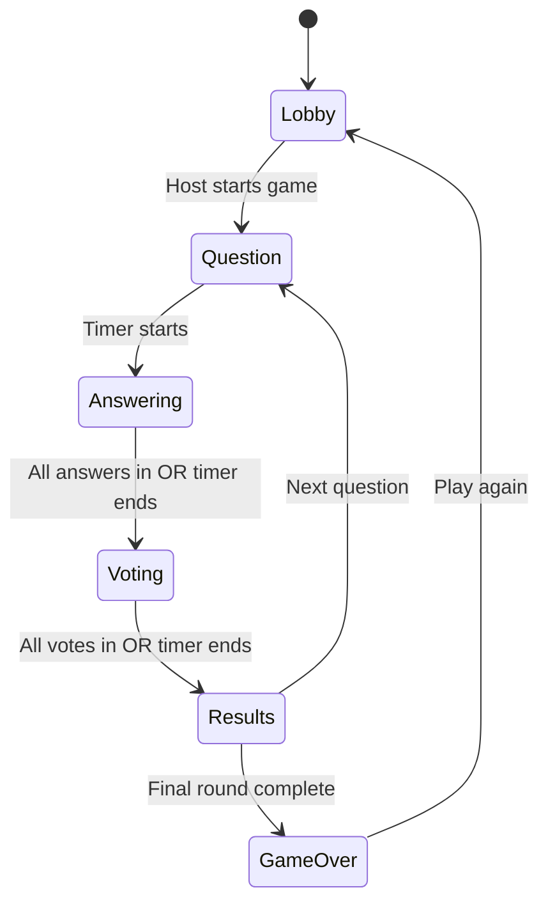

# Fibbage AI - Multiplayer Trivia Game

A real-time multiplayer trivia game where players submit fake answers to fool each other, and an AI (Claude) generates convincing lies to keep the game balanced and fun.

## Overview

**The Vibe:** Fibbage but the AI is trying to trick you.  
**Player Count:** 2-8 players

### Game Flow
1. **Setup**: A trivia question appears on the host screen
2. **Input**: Every player types in a fake answer to fool others
3. **Twist**: Claude AI generates a highly plausible but wrong answer
4. **Vote**: All answers appear on screen - players vote for the "real" answer
5. **Scoring**: Points for finding truth AND for tricking others

---

## Technology Stack

| Layer | Technology | Purpose |
|-------|------------|---------|
| **Frontend** | Next.js 14 + TypeScript | Host screen & player interfaces |
| **Real-time** | PartyKit | WebSocket-based multiplayer game state |
| **AI** | Claude API (Anthropic) | Fake answer generation |
| **Trivia Data** | Open Trivia Database | Question source with RAG enhancement |
| **Fuzzy Matching** | Fuse.js | Typo-tolerant answer validation |
| **Deployment** | Vercel + PartyKit Cloud | Hosting |

---

## Project Structure

```
fibbage/
├── app/                          # Next.js App Router
│   ├── layout.tsx               # Root layout
│   ├── page.tsx                 # Home/landing page
│   ├── host/
│   │   └── [roomId]/
│   │       └── page.tsx         # Host game board
│   └── play/
│       └── [roomId]/
│           └── page.tsx         # Player controller
├── party/
│   └── index.ts                 # PartyKit server (game logic)
├── lib/
│   ├── game-types.ts            # Shared TypeScript types
│   ├── trivia.ts                # Trivia fetching + RAG
│   ├── claude.ts                # AI fake answer generation
│   └── fuzzy-match.ts           # Fuse.js answer matching
├── components/
│   ├── host/                    # Host screen components
│   └── player/                  # Player interface components
├── public/
│   └── sounds/                  # Game sounds (optional)
├── .env.local                   # Environment variables
├── partykit.json                # PartyKit configuration
└── vercel.json                  # Vercel configuration
```

---

## Proposed Changes

### Core Infrastructure

#### [NEW] [partykit.json](file:///home/user/Documents/Projects/Fibbage/Fibbage/partykit.json)
PartyKit configuration for the game server.

#### [NEW] [vercel.json](file:///home/user/Documents/Projects/Fibbage/Fibbage/vercel.json)
Vercel deployment configuration with proper rewrites.

#### [NEW] [.env.example](file:///home/user/Documents/Projects/Fibbage/Fibbage/.env.example)
Template for required environment variables (ANTHROPIC_API_KEY, PARTYKIT_HOST).

---

### Game Engine (PartyKit Server)

#### [NEW] [party/index.ts](file:///home/user/Documents/Projects/Fibbage/Fibbage/party/index.ts)
The core game server handling:
- Room creation and player management
- Game state machine (phases: lobby → question → answer → voting → results → game-over)
- Real-time message broadcasting
- Score calculation
- Integration with Claude API for AI fake answers

---

### Shared Libraries

#### [NEW] [lib/game-types.ts](file:///home/user/Documents/Projects/Fibbage/Fibbage/lib/game-types.ts)
TypeScript interfaces for:
- Player, GameState, Question, Answer
- WebSocket message types
- Game phases enum

#### [NEW] [lib/trivia.ts](file:///home/user/Documents/Projects/Fibbage/Fibbage/lib/trivia.ts)
Trivia question fetching with search-based RAG:
- Fetch from Open Trivia Database
- Cache and deduplicate questions
- Provide context for AI answer generation

#### [NEW] [lib/claude.ts](file:///home/user/Documents/Projects/Fibbage/Fibbage/lib/claude.ts)
Claude API integration:
- Generate convincing fake answers
- Use question context for plausibility
- Error handling and fallbacks

#### [NEW] [lib/fuzzy-match.ts](file:///home/user/Documents/Projects/Fibbage/Fibbage/lib/fuzzy-match.ts)
Fuse.js fuzzy matching:
- Compare player guesses to correct answer
- Configurable threshold for typo tolerance
- Normalize text for comparison

---

### Frontend - Host Screen

#### [NEW] [app/host/[roomId]/page.tsx](file:///home/user/Documents/Projects/Fibbage/Fibbage/app/host/[roomId]/page.tsx)
Main game board displayed on a shared screen showing:
- Room code for players to join
- Current phase visualization
- Question display
- All submitted answers during voting
- Scoreboard and results

---

### Frontend - Player Interface

#### [NEW] [app/play/[roomId]/page.tsx](file:///home/user/Documents/Projects/Fibbage/Fibbage/app/play/[roomId]/page.tsx)
Mobile-friendly player controller:
- Name entry and join flow
- Answer submission input
- Voting buttons
- Personal score display
- Waiting states between phases

---

### Styling & UX

#### [NEW] [app/globals.css](file:///home/user/Documents/Projects/Fibbage/Fibbage/app/globals.css)
Custom CSS with:
- Dark mode game aesthetic
- Glassmorphism effects
- Smooth animations
- Responsive breakpoints
- Accessibility considerations

---

## Game State Machine



---

## Scoring System

| Action | Points |
|--------|--------|
| Guess correct answer | +1000 |
| Fool another player | +500 per player fooled |
| Vote for AI's answer | 0 (no penalty) |

---

## Verification Plan

### Automated Tests
1. Run `npm run build` to verify no TypeScript errors
2. Run `npm run lint` for code quality
3. Test PartyKit server locally with `npx partykit dev`

### Manual Verification
1. Open host screen in browser
2. Join as 2+ players from different devices/tabs
3. Complete full game loop
4. Verify scoring accuracy
5. Test on mobile devices for responsiveness

---

## User Review Required

> [!IMPORTANT]
> **API Keys Required**: You'll need to provide:
> - `ANTHROPIC_API_KEY` - Your Claude API key
> - The PartyKit host URL will be generated after deployment

> [!NOTE]
> **Trivia Source**: Using Open Trivia Database (free, no API key required). Questions may occasionally repeat in long sessions.

---

## Estimated Implementation Time

| Phase | Estimated Tool Calls |
|-------|---------------------|
| Project Setup | 5 |
| PartyKit Server | 10 |
| Host Screen | 10 |
| Player Interface | 10 |
| Styling & Polish | 10 |
| Testing & Fixes | 5 |
| **Total** | **~50** |
